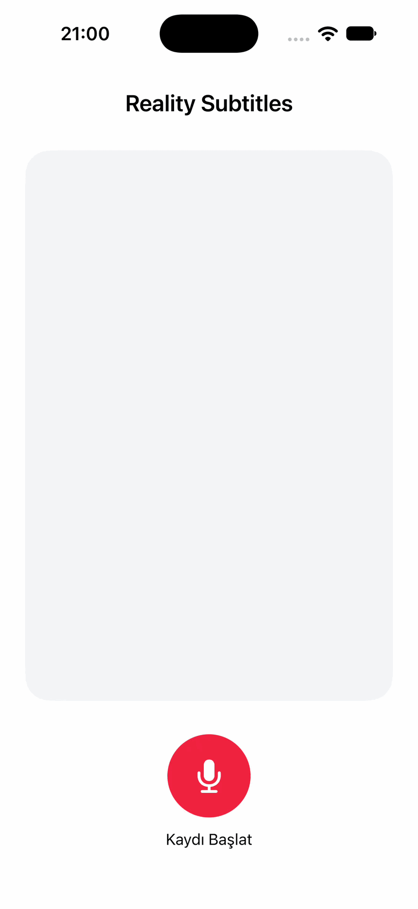

# Reality Subtitles

An early-stage project exploring real-time Turkish subtitles, with a SwiftUI iOS app and research into audio-visual speech recognition.

The current iOS milestone is microphone access and audio recording. Live transcription and visual speech recognition are planned work.

## App demo

<p align="center">
  
</p>

## Current status

| Component | Available today |
| --- | --- |
| iOS app | Microphone access, start/stop recording, and saving audio as `recording.m4a` |
| Web prototype | Turkish speech-to-text using the browser Web Speech API |
| Research | Initial notes on speech recognition, datasets, and audio-visual approaches |

## Run the iOS app

1. Clone this repository and open `ios/RealitySubtitles.xcodeproj` in Xcode.
2. Select the **RealitySubtitles** scheme and an iPhone simulator or connected iPhone.
3. For a physical device, select your signing team in **Signing & Capabilities**.
4. Run the app, allow microphone access, and use **Kaydı Başlat** / **Kaydı Durdur** to record audio.

The project currently targets **iOS 27.0** and was verified with **Xcode 27.0**. Recordings are stored in the app's Documents directory. Each new recording uses the same `recording.m4a` filename.

Build verification: the app, unit-test target, and UI-test target compiled successfully for iOS Simulator with signing disabled. This verifies compilation; it does not represent an automated microphone or recording test.

## Explore the repository

```text
reality-subtitles/
├── README.md
├── ios/
│   ├── RealitySubtitles/
│   ├── RealitySubtitles.xcodeproj/
│   ├── RealitySubtitlesTests/
│   └── RealitySubtitlesUITests/
├── demo/
│   └── index.html
└── docs/
    ├── project/
    └── progress/
        └── week-01/
```

- **[iOS app](ios/)** — current native application and its Xcode project.
- **[Web prototype](demo/index.html)** — the initial Turkish subtitle experiment. Open it in a browser supporting the Web Speech API and allow microphone access; support varies by browser.
- **[Week 1 research](docs/progress/week-01/Reality%20Subtitles%201.%20week.pdf)** — the original project notes, preserved for reference.

## Project documents

These Turkish-language documents describe the initial proposal and planned scope. They are planning references, not a record of implemented features or completed experiments. The current implementation status is listed above.

| Document | Purpose |
| --- | --- |
| [Project proposal (PDF)](docs/project/project-proposal.pdf) | Research question, proposed method, scope, and expected outputs |
| [Six-month plan (Word)](docs/project/six-month-plan.docx) | 24-week plan, milestones, evaluation approach, and risks |
| [Long-term vision (Word)](docs/project/long-term-vision.docx) | Future product directions beyond the initial iOS scope |

## Roadmap

- [x] Create the initial browser speech-to-text prototype.
- [x] Build the SwiftUI iOS app with audio recording.
- [ ] Add speech-to-text to the iOS app.
- [ ] Compare speech recognition approaches, including Whisper.
- [ ] Investigate visual speech recognition and suitable datasets.
- [ ] Explore an audio-visual subtitle architecture.
